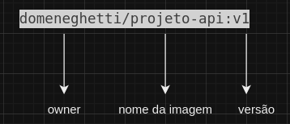

# Containers

### Máquinas Virtuais
Máquinas virtuais foram originalmente projetadas para permitir que vários sistemas operacionais sejam executados em uma única máquina física. O objetivo é permitir que os usuários criem um ambiente virtual isolado do hardware subjacente. As VMs abstraem os detalhes do hardware para facilitar a execução de aplicações em diferentes arquiteturas de hardware e usar os recursos de hardware com mais eficiência.

### Docker
O Docker, por outro lado, foi projetado para fornecer uma maneira leve e portátil de empacotar e executar aplicações em um ambiente isolado e reproduzível. O Docker abstrai os detalhes do sistema operacional para enfrentar o desafio de implantar aplicações em diferentes ambientes, como desenvolvimento, teste e produção. Pode ser muito desafiador gerenciar as atualizações do ambiente de software e manter a consistência do ambiente em todos os lugares. Isso é especialmente válido para organizações que executam centenas de aplicações ou decompõem aplicações em centenas de microsserviços. O Docker resolve esse problema por meio da estruturação em contêiner. 

### Quando usar uma máquina virtual
É melhor usar uma máquina virtual se você está executando aplicações com estes requisitos: 

- Dependências específicas do sistema operacional
- Requisitos de recursos de hardware substanciais
- A necessidade de definir vários controles nos sistemas operacionais
- Aplicações legadas que não são mais executadas em sistemas operacionais modernos
- Diferentes requisitos de sistema operacional com uma única infraestrutura física subjacente disponível

### Quando usar o docker
É melhor usar o Docker ao executar aplicações com estes requisitos: 

- Requisitos de recursos leves ou uma arquitetura de microsserviços
- Um ambiente de infraestrutura física distribuída, incluindo servidores baseados em nuvem
- Ciclos de implantação rápidos (já que Dockerfiles são mais fáceis de gerenciar do que configurações de VM)
- Um requisito de escalabilidade rápida

[Link Docker vs VM](https://aws.amazon.com/pt/compare/the-difference-between-docker-vm/)

## Docker Images 
Imagens são o ponto de inicio para se criar um container, é o template para como o container deve ser criado.

a image é o sistema de arquivos, com tudo que é necessário para sua aplicação executar deve estar configurado na imagem.

### Criando uma imagem:
- Dockerfile é a receita da criação da imagem, com todo o passo a passo para a geração da imagem. Nele temos a cópia de arquivo, comandos/scripts necessários, gerenciamento de pacotes, tudo está definido e declarado no nosso arquivo Dockerfile. 

Com isso, um ponto de atenção que temos é a necessidade de realmente conhecer a aplicação, as ações necessárias para ela executar, assim como o framework que foi utilizado.


### Criando o Dockerfile

```dockerfile
# Definindo a imagem base, com a estrutura inicial do sistema de arquivos
# FROM é utilizado para definição da imagem base
FROM node:20.17.0

# WORKDIR define qual o diretório de trabalho, ele cria a pasta e entra nela
WORKDIR /app

# Resolver as dependências do projeto através do NPM
# 1º vamos copiar o arquivo que esta no mesmo path do dockerfile com as configurações do projeto para a pasta app ou podemos usar ./ representando a pasta que estamos, que é a app, já que o workdir além de criar, entrou na pasta
COPY package*.json ./

# 2º Vamos instalar agora os pacotes, assim como fazemos ao fazer um git clone do projeto, para isso vamos o RUN para executar um comando dentro do docker, no nosso caso a instalação dos pacotes 
RUN npm install

# 3º Copiar todos os arquivos da aplicação da aplicação para a imagem
COPY . .

# 4º Vamos precisar expor a porta da aplicação para fora do container, para isso usamos o EXPOSE para dizer qual porta aquele container vai utilizar, nosso express listen esta ouvindo na porta 3000
EXPOSE 3000

# 5º CMD e ENTRYPOINT são comandos utilizados para inicializar a aplicação, não iremos abortar a fundo eles, mas usaremos o CMD em nossa aplicação, replicando o comando que usamos em nosso computador para executar a aplicação que seria node nome-arquivo.js
CMD ["node", "server.js"]
```

### Criando a imagem

```dockerfile
docker build -t projeto-api -f Dockerfile .
```

- -t Utilizado para definfir o nome da imagem que será criada
- -f Utilizado para definir qual arquivo do dockerfile será utilizado para construir a imagem
- .  Especifica qual diretório ou contexto que será utilizado pelo docker daemon para a construção da imagem

### Validando a imagem criada

```dockerfile
docker image ls
```

# DockerHUB
Repositório de imagens docker, pode ser acessado no link:
https://hub.docker.com/

Dockerhub, assim como o Github, possui sempre no começo do nome da imagem o nome do owner.

### Padrão de nome de image



Podemos realizar a alteração da Tag de uma imagem através do comando:

```docker
docker tag nome-imagem:versao nome-image:nova-
```

```dockerfile
docker login
```


informe seu usuário e senha ou o código de ativação no browser


A partir disso você já está autenticado e possui uma comunicação com seu docker hub ou seu docker registry, pois podemos ter diversos tipos de registry além do docker hub.

```dockerfile
docker push domeneghetti/projeto-api:latest
```


Validando no Repositório:


### Comandos Docker
- docker container ls | docker ps (opção -a para analisar todos): mostra os container criados
- docker run: executar alguns comandos internos para realizar um start de um container
- docker stop: parar um container
- docker start: inicializar um container
- docker pull ( ao executar um docker run o pull é realizado): baixar uma imagem
- docker logs container_ID: mostra os logs de execução do container
- docker inspect CONTAINER_ID: mostrar toda estrutura do container 
- docker image ls: listar as imagens baixadas
- docker create: para criação do container sem a execução do mesmo
- docker rm (-f para forçar sem a necessidade de um stop antes): remover um container
- docker rm $(docker ps -aq) -f : remover todos containers
- docker rmi: remover uma imagem
- docker build: construção de uma imagem com base em um Dockerfile
